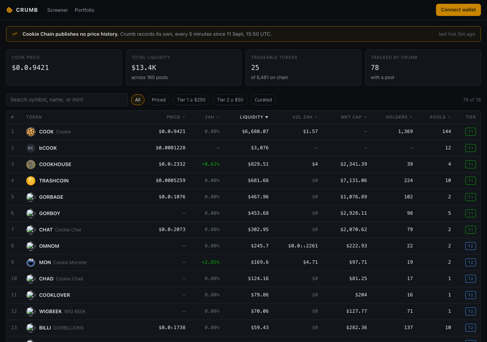
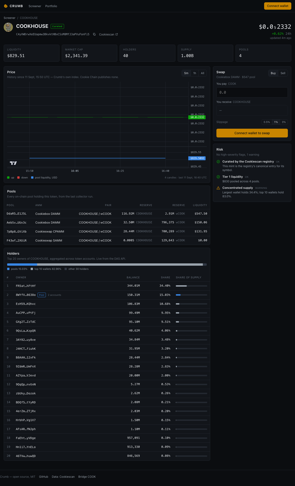
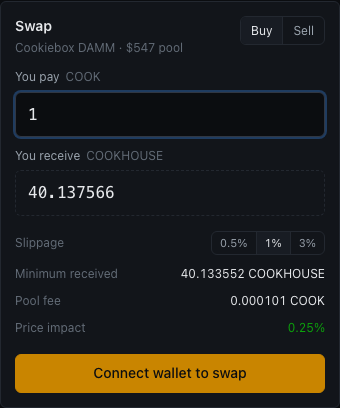

# Crumb

**Analytics and trading terminal for [Cookie Chain](https://cookiescan.io).** Screener, price
history, pools, holder distribution, risk flags, and on-chain swaps, built for a chain that is
two weeks old.

**Live:** https://crumb.vercel.app · **Repo:** https://github.com/Bekatsertsvadzee/crumb · MIT

## Why it exists

Cookie Chain publishes no price history. The Cookiescan API exposes a live price and a 24-hour
change and nothing else: no OHLC, no candles, no time series. There was no way to see what any
token did yesterday.

Crumb runs its own collector every five minutes. It reads all 160 AMM pools, aggregates them
into liquidity-weighted marks per token, and writes 5-minute and 1-hour candles to Postgres.
It has run continuously since 2026-09-11 15:50 UTC and is the only source of price history on
the chain. It cannot be backfilled, so every chart on Crumb is exactly as old as Crumb is, and
the UI says so.

The chain is also tiny: 6,481 tokens, 160 pools, about $13,000 of total liquidity, and a few
dollars a day of volume. A DexScreener clone renders a wall of zeros here. Crumb ranks by
liquidity and surfaces the numbers that carry signal at this scale: holder count, supply
concentration, liquidity tier, and whether a symbol belongs to the mint wearing it.

## Screenshots

| Screener | Token page |
|---|---|
|  |  |



## Features

- **Screener** — every token with a pool, sorted by liquidity by default. Filters for tier 1
  (≥ $250), tier 2 (≥ $50), curated, and priced. Prices use subscript notation (`$0.0₅2332`)
  because the chain trades at 1e-6 to 1e-8.
- **Charts** — 5m and 1h candlesticks from Crumb's own index with a pool-liquidity pane
  underneath. Tokens with fewer than two candles get an honest empty state, never a fake line.
- **Pools** — every pool backing a token: AMM, both reserves, USD liquidity.
- **Holders** — top 20 owners from the DAS `getTokenAccounts` endpoint, aggregated per owner,
  pool vaults labelled, with a concentration bar (pools / top 10 wallets / everyone else).
- **Risk** — impostor-mint check against the Cookiescan registry, liquidity tier, single-wallet
  majority and top-10 concentration, holder count, no-market flag.
- **Wallet** — Nightly (required by the chain) plus any Wallet Standard wallet the browser
  exposes. Address and COOK balance in the header.
- **Swap** — buy or sell any token that has a Cookiebox DAMM pool against COOK. Quote, fee,
  minimum received, price impact, slippage presets. Native COOK is wrapped and unwrapped inside
  the same transaction.
- **Send** — native COOK transfer.
- **Portfolio** — holdings from `getAssetsByOwner`, priced from Crumb's last tick.
- **Transaction UX** — building → signing → confirming → confirmed with a Cookiescan link,
  blockhash-expiry detection, and error copy for: user rejected, insufficient COOK, slippage
  exceeded, expired, RPC unreachable, wallet not installed, on-chain program error.

## Architecture

```
                      every 5 min (GitHub Actions cron)
 api.cookiescan.io ───────────────► scripts/collect.mjs ──► Supabase (Postgres)
   /api/markets  160 pools           liquidity-weighted        tokens · token_state
   /v1/assets    metadata            marks per token           candles_5m · candles_1h
                                                               markets · market_liquidity_1h
                                                               chain_stats_5m
                                                                     │  anon key, RLS read-only
                                                                     ▼
 api.cookiescan.io  (DAS: holders, portfolio; registry search) ◄── Next.js 15 app (Vercel)
 rpc.cookiescan.io  (pool state, quotes, send, confirm)        ◄── server components + client
                                                                   wallet-adapter (Nightly)
```

The collector is zero-dependency Node and writes through one atomic `crumb_ingest(jsonb)` RPC
per run. The app reads with the public anon key; every table is RLS public-read, writes require
the service role, which never ships to the browser.

### The swap

Cookiebox DAMM (`DAMMjDCEFTDkt7ywazZS8GoaLtjb3HaJo3pLbf64xrPY`) is a byte-identical redeploy of
Meteora's CP-AMM: same `account:Pool` discriminator, same 1112-byte layout, and a swap built
from Meteora's IDL against the Cookiebox program id simulates successfully on the live chain.
Crumb reuses `@meteora-ag/cp-amm-sdk` for the IDL and quote math only, instantiating the Anchor
program with the pool's actual owner as its address. Jupiter v6 is deployed on the chain but
Jupiter's hosted API does not index it, so there is no aggregator route.

## Local setup

Requires Node 20+.

```bash
git clone https://github.com/Bekatsertsvadzee/crumb
cd crumb
npm install
cp .env.example .env
```

Fill in `.env`:

| Variable | Where it comes from |
|---|---|
| `NEXT_PUBLIC_SUPABASE_URL` | Supabase → Project Settings → API |
| `NEXT_PUBLIC_SUPABASE_ANON_KEY` | the `sb_publishable_…` key (not the secret one) |
| `NEXT_PUBLIC_RPC_URL` | `https://rpc.cookiescan.io` |
| `NEXT_PUBLIC_EXPLORER` | `https://cookiescan.io` |
| `NEXT_PUBLIC_SITE_URL` | your deployment URL, for Open Graph tags |

Then:

```bash
npm run build     # type-checks and builds
npm run dev       # http://localhost:3000
```

To point the app at your own history database instead of Crumb's, create a Supabase project,
run `supabase/schema.sql` in the SQL editor, and deploy the collector (below). The app renders
the screener from `token_state` and the charts from `candles_5m` / `candles_1h`; nothing else
is needed.

## Collector deployment

The collector needs the **service role** key and nothing else.

```bash
SUPABASE_URL=… SUPABASE_SERVICE_ROLE_KEY=… npm run collect         # one run
npm run collect:test                                              # offline self-test
```

`.github/workflows/collect.yml` runs it every five minutes. Add `SUPABASE_URL` and
`SUPABASE_SERVICE_ROLE_KEY` as repository secrets and the workflow is live. It has
`workflow_dispatch` enabled: if a run fails, re-run it manually rather than waiting, because
every missed bucket is a permanent gap. GitHub's cron is best-effort and can lag several minutes
under load; the candle bucket is computed server-side from the ingest time, so late runs still
land in the right slot.

## Cookie Chain reference

| | |
|---|---|
| RPC | `https://rpc.cookiescan.io` |
| Explorer | `https://cookiescan.io` (`/tx/<sig>`, `/address/<pk>`) |
| Core | solana-core 4.1.2 — `@solana/web3.js` v1 works unchanged |
| Genesis hash | `9wDaBRDgArEUpvhHxGguNkwozsZh4UpGZB9o2EoEcBB2` |
| Native token | COOK, 9 decimals, pays fees |
| COOK mint | `36ZrtQoab5MhhySaP1YSTwUahSk6GRVUTtZ6cuVfm9e1` |
| Wrapped COOK | `So11111111111111111111111111111111111111112` (the wSOL address) |
| Bridge | https://hyperlane.cookiescan.io |

There is no testnet, devnet, or faucet. One live network.

### AMM programs

| Type | Pools | Program | Crumb |
|---|---|---|---|
| Cookieswap CPAMM | 96 | `xYBN2zddsqSy41tg1yD9nJScCmqquZnHUyzXBfLEqC8` | reads |
| Cookiebox DAMM | 28 | `DAMMjDCEFTDkt7ywazZS8GoaLtjb3HaJo3pLbf64xrPY` | reads + swaps |
| Cookieswap SAMM | 23 | `WTzkPUoprVx7PDc1tfKA5sS7k1ynCgU89WtwZhksHX5` | reads |
| Cookiebox CLMM | 11 | `CLMMmWqTtyNSomqXP3kETJy2SGKPdr31USsm4GfbLyKs` | reads |
| Meteora DAMM | 2 | `cpamdpZCGKUy5JxQXB4dcpGPiikHawvSWAd6mEn1sGG` | reads + swaps |

## Project layout

```
scripts/collect.mjs        collector (zero deps)
supabase/schema.sql        tables, crumb_ingest RPC, RLS
app/                       Next.js routes: / (screener), /token/[mint], /portfolio, /api/portfolio
components/                Screener, PriceChart, HoldersPanel, RiskPanel, SwapPanel, SendPanel, wallet
lib/db.ts                  Supabase queries        lib/swap.ts   CP-AMM quote + instruction
lib/cookiescan.ts          DAS + registry          lib/tx.ts     send/confirm state machine
lib/analytics.ts           holder stats, risk      lib/format.ts subscript prices, USD, dates
```

## Credits

Market, asset, holder and registry data from [Cookiescan](https://api.cookiescan.io).
Charts by [TradingView Lightweight Charts](https://github.com/tradingview/lightweight-charts).
CP-AMM IDL and math from [Meteora](https://github.com/MeteoraAg/cp-amm-sdk).

## License

MIT
